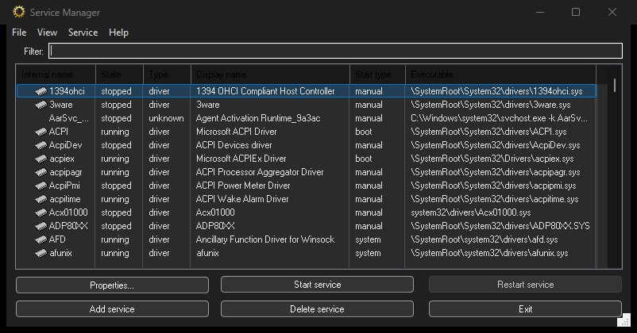
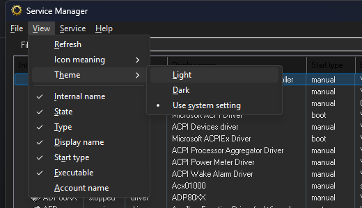
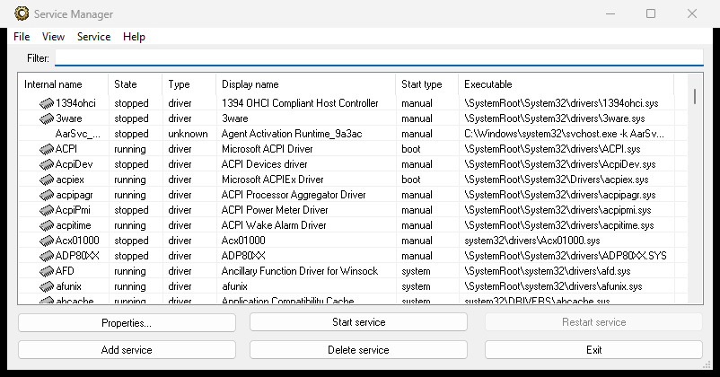

# Service Manager for Windows (srvman) 1.0

A small native Windows tool for managing services and drivers: browse everything the
Service Control Manager knows about, edit configuration, start and stop services, install
a driver or turn an ordinary executable into a service — from a GUI or from the command
line.



Originally written by [SysProgs](https://sysprogs.org/). This repository is a maintained
build of the 1.0 sources: the dead Visual Studio 2008 project has been replaced with a
script that drives the compiler directly, the BazisLib subset it depends on is vendored,
and the UI has gained dark/light/system theme support. Those changes are what this build
numbers **1.1.0** — see [Versioning](#versioning-and-release-archives).

## Features

- **Service browser** — internal name, state, type, display name, start type, executable
  and logon account, with per-column show/hide and a live filter box.
- **Service properties** — edit display name, binary path (Win32 and raw NT form), service
  type, start mode, load order group, logon account and description.
- **Control** — start, stop and restart, from the toolbar buttons or the Service menu.
- **Add and delete services**, including kernel and filesystem drivers.
- **Run any executable as a service** via the built-in `/RunAsService:` shim, for programs
  that were never written to be services.
- **Command-line interface** for scripted installs, driver loading and service control.
- **Dark, light and system theme** — see [Theme](#theme).

## Requirements

**To run:** Windows 7 or later, 32-bit or 64-bit. Most operations need administrator
rights, since they modify the service database.

**To build:**

- Visual Studio 2017 or newer (or the Build Tools) with:
  - *MSVC v14x C++ x64/x86 build tools*
  - *C++ ATL for latest build tools (x86 & x64)* — srvman is an ATL/WTL application and
    will not build without it
- Python 3.9 or newer
- Network access on the first build, to fetch the WTL headers (see
  [Dependencies](#dependencies) for the offline route)

## Building

```
python build.py                      # Release, x64
python build.py --arch x86           # Release, 32-bit
python build.py --arch both          # both architectures
python build.py --config Debug
python build.py --rebuild --verbose  # full rebuild, echo every command line
python build.py --clean              # remove build/ and dist/
```

Output lands in `build/<arch>/<Config>/srvman.exe`. The Release build is statically linked
against the CRT (`/MT`), so the executable is self-contained — copy it anywhere and run it.

The script locates Visual Studio through `vswhere`, runs `vcvarsall.bat` for the requested
target, compiles every translation unit in parallel and links with an embedded manifest —
comctl32 v6 from the `#pragma` directives in `src/stdafx.h`, merged with the DPI awareness
declaration in `src/srvman.manifest`. There is no precompiled header, and touching any
header under `src/` triggers a full rebuild.

### High DPI

The binary declares itself **system DPI aware**, so Windows lets it draw at the real
resolution instead of stretching a 96 DPI bitmap — that stretching is what used to make
the text blurry at 125% and above. Dialog layouts scale on their own (USER32 derives
dialog units from the dialog font); the sizes the code states in pixels go through
`src/Dpi.h`. Awareness is per process and fixed at startup: moving the window to a monitor
with a different scale falls back to stretching until srvman is restarted there.

Useful extras:

| Flag | Purpose |
| --- | --- |
| `--wtl <path>` | use an existing WTL instead of downloading one |
| `--offline` | never download anything; fail if WTL is missing |
| `--bazislib <path>` | build against an external BazisLib checkout |
| `--sync-bazislib <path>` | refresh `src/BazisLib` from an upstream checkout |
| `--package` | zip the built binaries into `dist/` |
| `--version` | print the version and exit |
| `-j N` | parallel compiler jobs (defaults to the CPU count) |

### Versioning and release archives

The version number lives in one place, `src/version.h`, and feeds the executable's
`VERSIONINFO` resource, the About box, the `/?` banner and the names of the release
archives. To cut a release, bump it there and build with `--package`:

```
python build.py --arch both --package
```

That writes `dist/srvman-<version>-<arch>.zip` — currently `dist/srvman-1.1.0-x64.zip` and
`dist/srvman-1.1.0-x86.zip` — each unpacking to a directory of the same name containing
`srvman.exe`, this README and the BazisLib licence. Debug archives are suffixed
`-Debug` and carry the `.pdb` alongside the binary.

`src/version.h` spells the number twice (a numeric triplet for `VERSIONINFO`, and a string
literal, because `rc.exe` will not concatenate adjacent string literals). The build script
parses both and refuses to build if they disagree.

## Usage

Run `srvman.exe` with no arguments for the GUI. With arguments it attaches to the parent
console and runs as a command-line tool:

```
srvman add <binary file> [service name] [display name]
           [/type:drv|exe|fsd] [/start:boot|sys|man|dis]
           [/interactive:no] [/overwrite:yes]
srvman drvadd <driver service name>
srvman delete <service name>
srvman start   <service name> [/nowait] [/delay:msec]
srvman stop    <service name> [/nowait] [/delay:msec]
srvman restart <service name> [/nowait] [/delay:msec]
srvman run <.sys file> [/copy:yes] [/overwrite:no] [/stopafter:<msec>]
srvman /?
```

`add` infers the service type from the extension — a `.sys` file becomes a kernel driver,
anything else an own-process service. `drvadd` registers a driver that is already sitting
in `System32\drivers`. `run` installs a driver, starts it, and optionally stops it again
after a delay, which is the quick path for loading a test driver.

Add `/pause` (or `/pause:no`) to override whether the tool waits for a keypress before
exiting.

## Theme

**View → Theme → Light / Dark / Use system setting.**



*Use system setting* is the default: srvman follows Windows' *Choose your default app mode*
and re-themes live, without a restart, when you change it. An explicit Light or Dark choice
overrides the system setting in both directions.

Everything the application draws follows the theme — title bar, menu bar and popup menus,
service list and its header, edit fields, combo boxes and buttons, in the main window and
in the Properties and About dialogs. System-owned windows (message boxes, the file browser)
follow Explorer rather than srvman, so they stay light.

| Dark | Light |
| --- | --- |
|  |  |

Dark mode requires Windows 10 1809 (build 17763) or later — the APIs simply do not exist
before that. On Windows 7, 8 and earlier Windows 10 the Dark entry is greyed out and the
application looks exactly as it always has. High Contrast mode also forces the light path,
so it is never painted over.

The preference is stored in `HKLM\SOFTWARE\SysProgs\SrvMan` under the value `Theme`,
alongside the column widths and icon display mode. Note that writing there requires
elevation — run srvman as administrator if you want the setting to persist. Reading works
either way.

## Project layout

```
build.py              the build system
src/                  srvman sources
  Theme.h/.cpp        dark/light/system theme support
  MainDlg.*           main window (service list, filter, menu)
  PropertiesDlg.*     service properties / add service dialog
  cmdline.cpp         command-line mode
  runassrv.cpp        the /RunAsService: shim
  srvman.rc           dialogs, menu, version info
  res/                icons
  BazisLib/           vendored BazisLib subset (LGPL-3.0)
third_party/wtl-*/    WTL headers, fetched by the build script
build/<arch>/<Config> build output
docs/                 screenshots used by this README
```

`src/srvman.sln` and `src/srvman.vcproj` are the original Visual Studio 2008 project files.
They are kept for reference only — they reference a BazisLib layout that no longer exists
and modern MSBuild cannot consume the format. Use `build.py`.

## Dependencies

**BazisLib** (LGPL-3.0) provides the registry, string, path and service-control wrappers.
Only the subset srvman actually compiles against is vendored in `src/BazisLib`, so a build
needs nothing checked out beside this repository. See `src/BazisLib/UPSTREAM.md` for
provenance and `src/BazisLib/LICENSE` for the licence. Refresh it with:

```
python build.py --sync-bazislib <path-to-BazisLib-checkout>
```

**WTL 10.0.10320** supplies the dialog and control classes. It is not vendored — the build
script downloads it into `third_party/` on first use and verifies its SHA-512. For an
air-gapped build, download
[WTL10_10320_Release.zip](https://sourceforge.net/projects/wtl/files/WTL%2010/) yourself
and pass `--wtl <path>` or set `WTL_INCLUDE`. The script applies one upstream fix on
extraction: a Unicode bug in `atlmisc.h` (SourceForge bug #329).

**ATL** comes from Visual Studio.

## Licence

srvman is LGPL, per the licence recorded in its version resource. The vendored BazisLib
subset is LGPL-3.0 and carries its own `LICENSE`. WTL is distributed under the Microsoft
Public Licence and is not redistributed here.

## Credits

Service Manager for Windows and BazisLib are the work of
[SysProgs](https://sysprogs.org/) — original project page:
<http://tools.sysprogs.org/srvman/>.
